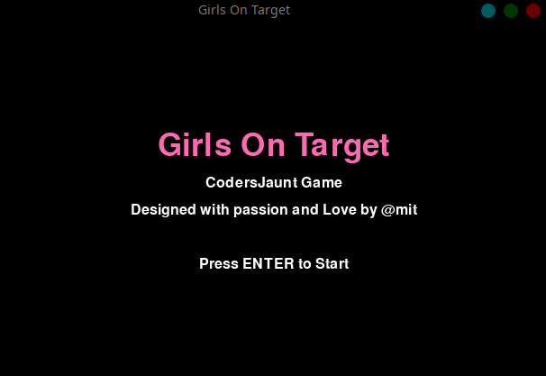
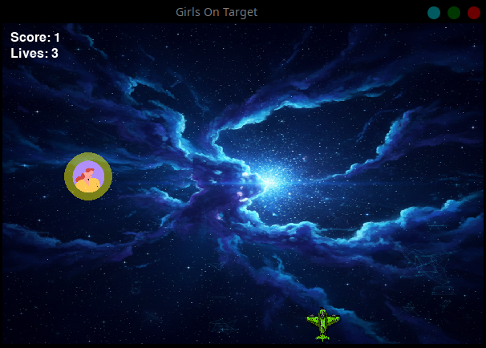

# 🎮 Girls On Target
### A CodersJaunt Arcade Game

<p align="center">
  
</p>

<p align="center">
  <b>Designed with passion and ❤️ by @mit</b><br>
  <i>Learning Python by building real games</i>
</p>

---

### 🚀 Built With
<p align="center">
  
  
  
  
  
</p>

## 🌟 About the Game

**Girls On Target** is a fast-paced 2D arcade shooting game built using Python + Pygame. 

You control a fighter plane ✈️ and must shoot down incoming enemies before they:
1. Escape the screen 🚫
2. Or crash into your plane 💥

This game is part of the **CodersJaunt Learning Games Series**, where logic comes before syntax.

### 🖼️ Gameplay Snapshots
<p align="center">
  
</p>

---

## 🎮 Controls

| Key | Action |
| :---: | :--- |
| **⬅️ / ➡️** | Move Left / Right |
| **⬆️ / ⬇️** | Move Up / Down |
| **SPACE** | Shoot |
| **ENTER** | Start Game |
| **ESC** | Pause / Resume |
| **C** | Continue Game |
| **Q** | Quit Game |
| **R** | Restart After Game Over |

---

## 🧠 Game Features
* 🎬 **Animated Intro Screen**
* ⏸️ **Pause & Resume Menu**
* 👽 **Multiple rotating enemy sprites**
* 💥 **Blast animation on hit**
* 🎯 **Score & lives system**
* ☠️ **Game Over & Restart logic**
* 🧼 **Clean, beginner-friendly code**

---

## 📂 Project Structure

```text
Girls-On-Target/
│
├── plane.py           # Main game loop
├── README.md          # Documentation
├── assets/            # Game Art & Sounds
│   ├── background.png
│   ├── plane-animated.png
│   ├── Bullet.png
│   ├── blast.png
│   ├── enemy1.png ... enemy26.png
│
├── gitImg/            # Images for README
│   ├── GirlsOnTarget1.png
│   └── GirlsOnTarget2.png
│
└── venv/              # Virtual Environment (Optional)
⚙️ Setup & Installation
1. Requirements

Python 3.8+

Pygame

2. Install Pygame

Bash
python -m venv venv

source venv/bin/activate 

pip install pygame

3. Run the Game

Bash
python plane.py
Note: Make sure you run the command from the project root directory so assets load correctly.

🧪 What You Learn From This Project
This game is designed to teach:

✅ Game loops & FPS control

✅ Keyboard input handling

✅ Collision detection (Rect objects)

✅ Sprite animation logic

✅ State management (Intro / Pause / Game Over)

✅ Real-world Pygame patterns

Perfect for:

🧑‍🎓 Students

🐍 Python beginners

🎮 Game-dev curious minds

🛠️ Future Enhancements (Ideas)
[ ] 🔊 Sound effects & background music

[ ] 🏆 High-score saving (File I/O)

[ ] 🎯 Increasing difficulty levels

[ ] 🕹️ Controller support

❤️ Credits
Developer: @mit 

Series: CodersJaunt - SwagCode4U

Engine: Pygame

Language: Python

📜 License
This project is open for learning and educational purposes.

Fork it, break it, improve it — that’s how coders grow 🚀

🌟 If you like this project 🌟


⭐ Star the repo | 🍴 Fork it | 🧠 Learn from it 
